# Reto-3
**Ejercicio, clase 7**
Cree la clase Rectangle.
The rectangle should be inicialice using any of these 3 methods:

Method 1: Bottom-left corner(Point) + width and height
Method 2: Center(Point) + width and height
Method 3: Two opposite corners (Points) e.g. Bottom-left and Upper-right
width, height, center: Instance attributes

compute_area(): should return the area of the rectangle

compute_perimeter(): should return the perimeter of the rectangle

Create a class Square() that inherited the required attributes and methods from Rectangle.

Create a method called compute_interference_point(Point) that returns if a point is inside or a rectangle.

Optional: Define a method called compute_interference_line() that return if a line or part of it is inside of a rectangle.

**Descripción del ejercicio**
se implementó la clase Rectangle, la cual puede construirse utilizando métodos distintos: se hizo usando dos esquinas opuestas. Se definieron atributos como width, height y center, y métodos como compute_area() y compute_perimeter() para calcular el área y el perímetro. Además, se creó la clase Square que hereda de Rectangle, y se implementó el método compute_interference_point() para verificar si un punto está dentro del rectángulo.
```python
class Point:
    def __init__(self, x, y):
        self.x = x
        self.y = y

class Rectangle:
    def __init__(self, bottom_left: Point, upper_right: Point):
        self.bottom_left = bottom_left
        self.upper_right = upper_right
        self.width = abs(self.upper_right.x - self.bottom_left.x)
        self.height = abs(self.upper_right.y - self.bottom_left.y)
        self.center = Point(
            (self.bottom_left.x + self.upper_right.x) / 2,
            (self.bottom_left.y + self.upper_right.y) / 2
        )

    def _area(self):
        return self.width * self.height

    def rect_perimeter(self):
        return 2 * (self.width + self.height)

    def rect_inter_point(self, point: Point):
        return (self.bottom_left.x <= point.x <= self.upper_right.x and
                self.bottom_left.y <= point.y <= self.upper_right.y)

class Square(Rectangle):
    def __init__(self, center: Point, side_length: float):
        half = side_length / 2
        bottom_left = Point(center.x - half, center.y - half)
        upper_right = Point(center.x + half, center.y + half)
        super().__init__(bottom_left, upper_right)

if __name__ == "__main__":
    rect = Rectangle(Point(0, 0), Point(4, 5))
    print("Área del rectángulo:", rect._area())
    print("Perímetro del rectángulo:", rect.rect_perimeter())

    punto = Point(2, 3)
    print("¿El punto está dentro del rectángulo?", rect.rect_inter_point(punto))

    cuadrado = Square(Point(5, 5), 4)
    print("Área del cuadrado:", cuadrado._area())
    print("Perímetro del cuadrado:", cuadrado.rect_perimeter())
```
**Ejercicio, clase 8**
Create class Line.
length, slope, start, end: Instance attributes, two of them being points (so a line is composed at least of two points).
compute_length(): should return the line´s length
compute_slope(): should return the slope of the line from tje horizontal in deg.
compute_horizontal_cross(): should return if exists the intersection with x-axis
compute_vertical_cross(): should return if exists the intersection with y-axis
Redefine the class Rectangle, adding a new method of initialization using 4 Lines (composition at its best, a rectangle is compose of 4 lines).

Optional: Define a method called discretize_line() that creates an array on n equally spaced points in the line and assigned as a instance attribute.

**Descripción del ejercicio**
En el ejercicio de la clase 8 se aplicaron los conceptos de composición para construir la clase Rectangle a partir de cuatro objetos Line, cada uno representando un lado del rectángulo. Se definió la clase Line con atributos como punto inicial y final, y métodos para calcular la longitud, la pendiente, y verificar si la línea cruza los ejes X o Y. Luego, la clase Rectangle se diseñó para recibir dos esquinas opuestas y generar sus lados como líneas, permitiendo calcular el área y el perímetro. Opcionalmente, se implementó el método discretize_line() para generar puntos equidistantes sobre una línea.
```python
class Point:
    def __init__(self, x, y):
        self.x = x
        self.y = y
import math

class Line:
    def __init__(self, start: Point, end: Point):
        self.start = start
        self.end = end
        self.length = self.compute_length()
        self.slope = self.compute_slope()

    def compute_length(self):
        return math.sqrt((self.end.x - self.start.x)**2 + (self.end.y - self.start.y)**2)

    def compute_slope(self):
        dx = self.end.x - self.start.x
        dy = self.end.y - self.start.y
        if dx == 0:
            return float('inf')  # pendiente infinita (línea vertical)
        return math.degrees(math.atan(dy / dx))

    def compute_horizontal_cross(self):
        return self.start.y * self.end.y <= 0

    def compute_vertical_cross(self):
        return self.start.x * self.end.x <= 0
    
    def discretize_line(self, n):
        dx = (self.end.x - self.start.x) / (n - 1)
        dy = (self.end.y - self.start.y) / (n - 1)
        return [Point(self.start.x + i * dx, self.start.y + i * dy) for i in range(n)]


class Rectangle:
    def __init__(self, bottom_left: Point, upper_right: Point):
        top_left = Point(bottom_left.x, upper_right.y)
        bottom_right = Point(upper_right.x, bottom_left.y)

        self.left = Line(bottom_left, top_left)
        self.right = Line(bottom_right, upper_right)
        self.top = Line(top_left, upper_right)
        self.bottom = Line(bottom_left, bottom_right)

    def compute_area(self):
        return self.left.length * self.bottom.length

    def compute_perimeter(self):
        return 2 * (self.left.length + self.bottom.length)
    
if __name__ == "__main__":
    # Crear dos puntos para una línea diagonal
    start = Point(-2, -3)
    end = Point(4, 5)
    diagonal = Line(start, end)

    print(" Línea diagonal")
    print("Longitud:", diagonal.compute_length())
    print("Pendiente (grados):", diagonal.compute_slope())
    print("¿Cruza eje X?", diagonal.compute_horizontal_cross())
    print("¿Cruza eje Y?", diagonal.compute_vertical_cross())

    # Discretizar la línea en 5 puntos
    puntos_discretos = diagonal.discretize_line(5)
    print("Puntos discretizados:")
    for i, p in enumerate(puntos_discretos):
        print(f"Punto {i+1}: ({p.x:.2f}, {p.y:.2f})")

    # Crear un rectángulo con dos esquinas opuestas
    esquina1 = Point(1, 1)
    esquina2 = Point(6, 4)
    rect = Rectangle(esquina1, esquina2)

    print("\n Rectángulo compuesto por líneas")
    print("Área:", rect.compute_area())
    print("Perímetro:", rect.compute_perimeter())
    print("Pendiente de la línea superior:", rect.top.compute_slope())
```
**RETO 3**
Create a repo with the class exercise
Restaurant scenario: You want to design a program to calculate the bill for a customer's order in a restaurant.
Define a base class MenuItem: This class should have attributes like name, price, and a method to calculate the total price.
Create subclasses for different types of menu items: Inherit from MenuItem and define properties specific to each type (e.g., Beverage, Appetizer, MainCourse).
Define an Order class: This class should have a list of MenuItem objects and methods to add items, calculate the total bill amount, and potentially apply specific discounts based on the order composition.
Create a class diagram with all classes and their relationships. The menu should have at least 10 items. The code should follow PEP8 rules.

**Descripción del ejercicio**
En el Reto 3 se diseñó un sistema para calcular la factura de un pedido en un restaurante, aplicando los principios de herencia y composición. Se creó una clase base MenuItem con atributos como name y price, y se definieron subclases como Beverage, Appetizer y MainCourse, que heredan de MenuItem y agregan atributos específicos como size, is_vegan y calories. Además, se implementó la clase Order, que utiliza composición para almacenar una lista de elementos del menú y calcular el total del pedido, aplicando un descuento si hay cinco o más productos. El menú incluye más de diez elementos variados, cumpliendo con los requisitos del ejercicio.
```python
class MenuItem:
    def __init__(self, name, price):
        self.name = name
        self.price = price

    def get_total_price(self):
        return self.price
class Beverage(MenuItem):
    def __init__(self, name, price, size):
        super().__init__(name, price)
        self.size = size  # pequeño, mediano, grande

class Appetizer(MenuItem):
    def __init__(self, name, price, is_vegan):
        super().__init__(name, price)
        self.is_vegan = is_vegan

class MainCourse(MenuItem):
    def __init__(self, name, price, calories):
        super().__init__(name, price)
        self.calories = calories 

class Order:
    def __init__(self):
        self.items = []

    def add_item(self, item: MenuItem):
        self.items.append(item)

    def calculate_total(self):
        return sum(item.get_total_price() for item in self.items)

    def apply_discount(self):
        total = self.calculate_total()
        if len(self.items) >= 5:
            return total * 0.9  # 10% de descuento
        return total

if __name__ == "__main__":
    menu = [
        Beverage("Jugo de mango", 6000, "mediano"),
        Beverage("Agua con gas", 4000, "pequeño"),
        Beverage("Limonada", 5000, "grande"),
        Appetizer("Arepitas con guacamole", 8000, True),
        Appetizer("Empanadas de carne", 7000, False),
        Appetizer("Patacones con hogao", 7500, True),
        MainCourse("Bandeja paisa", 18000, 1200),
        MainCourse("Ajiaco", 16000, 900),
        MainCourse("Arroz con pollo", 14000, 850),
        MainCourse("Pasta al pesto", 15000, 700)
    ]

    order = Order()
    order.add_item(menu[0])
    order.add_item(menu[3])
    order.add_item(menu[6])
    order.add_item(menu[7])
    order.add_item(menu[9])

    print("Total sin descuento:", order.calculate_total())
    print("Total con descuento:", order.apply_discount())
```
**Diagrama**

```mermaid
classDiagram
    class MenuItem {
        -name: str
        -price: float
        +get_total_price(): float
    }

    class Beverage {
        -size: str
    }

    class Appetizer {
        -is_vegan: bool
    }

    class MainCourse {
        -calories: int
    }

    MenuItem <|-- Beverage
    MenuItem <|-- Appetizer
    MenuItem <|-- MainCourse

    class Menu {
        +items: List[MenuItem]
    }

    Menu "1" *-- "many" MenuItem

    %% Ejemplos de instancias del menú
    class JugoDeMango {
        <<Beverage>>
        name = "Jugo de mango"
        price = 6000
        size = "mediano"
    }

    class AguaConGas {
        <<Beverage>>
        name = "Agua con gas"
        price = 4000
        size = "pequeño"
    }

    class Limonada {
        <<Beverage>>
        name = "Limonada"
        price = 5000
        size = "grande"
    }

    class Arepitas {
        <<Appetizer>>
        name = "Arepitas con guacamole"
        price = 8000
        is_vegan = true
    }

    class Empanadas {
        <<Appetizer>>
        name = "Empanadas de carne"
        price = 7000
        is_vegan = false
    }

    class Patacones {
        <<Appetizer>>
        name = "Patacones con hogao"
        price = 7500
        is_vegan = true
    }

    class BandejaPaisa {
        <<MainCourse>>
        name = "Bandeja paisa"
        price = 18000
        calories = 1200
    }

    class Ajiaco {
        <<MainCourse>>
        name = "Ajiaco"
        price = 16000
        calories = 900
    }

    class ArrozConPollo {
        <<MainCourse>>
        name = "Arroz con pollo"
        price = 14000
        calories = 850
    }

    class PastaAlPesto {
        <<MainCourse>>
        name = "Pasta al pesto"
        price = 15000
        calories = 700
    }

    Menu --> JugoDeMango
    Menu --> AguaConGas
    Menu --> Limonada
    Menu --> Arepitas
    Menu --> Empanadas
    Menu --> Patacones
    Menu --> BandejaPaisa
    Menu --> Ajiaco
    Menu --> ArrozConPollo
    Menu --> PastaAlPesto
```

